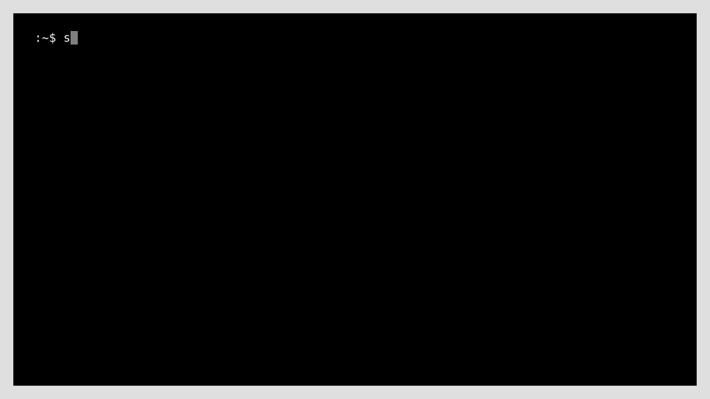
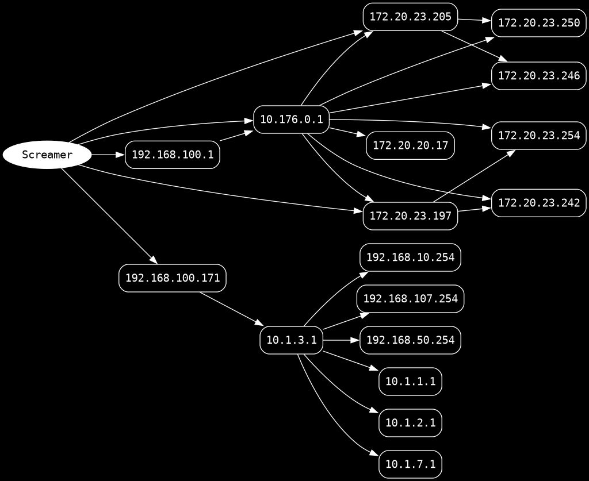

Screamer is a network reconnaissance tool designed for fast subnet discovery under conditions with unknown network addressing. Instead of scanning all hosts, it heuristically probes likely gateway addresses in each subnet and listens to traffic, gathering information about nearby hosts.

# The Overview

During a penetration test or infrastructure maintenance, one common challenge comes up: understanding the network topology with unknown or poorly documented addressing, and identifying routing devices and the subnets behind them. Port scanning seemed like the obvious solution, but when applied to large ranges like `10.0.0.0/8`, it is costly for two reasons:

1. Exhaustively scanning all addresses and ports places a significant load on the production equipment, which may be sensitive to such stress

2. A significant part of the address space may not be used, but this does not shorten the already long scan

This tool manipulates the TTL value. Every IPv4 packet has a TTL field, which is decremented by one at each router (hop). When it reaches zero, the router discards the packet and sends back an ICMP Time Exceeded packet ([RFC 792](https://datatracker.ietf.org/doc/html/rfc792), Page 7), causing the router to reveal its address.
By incrementally increasing the TTL value, the tool forces each router along the path to "introduce" themselves in order, creating a chain of hops all the way to the destination. If the destination responds successfully (Echo Reply, Timestamp Reply, TCP ACK, TCP RST, Port Unreachable), this suggests that the subnet is reachable.

# Install

Works on Unix-like systems and requires Python 3.7 or later. The tool uses raw sockets and runs as root, so installation via pipx with the `--global` flag is mandatory: with a user-level installation (`~/.local/bin`), the command is not included in the root-user's PATH.
```bash
sudo pipx install --global git+https://github.com/ifritnoises/screamer
```

# Active Reconnaissance

Active mode sends packets with incrementally increasing TTL values across a specified range and maps the network: which hops exist and which subnets they connect to.

"Screamer" uses multiple protocols, which allows it to get past filters that block one type of traffic but allow another:

1. ICMP: Ping (Type 8) is often blocked by ACLs, but timestamp request (Type 13) is also available
2. TCP and UDP: Testing closed ports may trigger an ICMP port unreachable packet (Type 3, Code 3), which confirms that the host is active

```bash
screamer active --help
```

| Flag               | Purpose                                                      |
| :----------------- | ------------------------------------------------------------ |
| `-m` / `--method`  | Protocols in use: icmp-echo (default), icmp-timestamp, tcp, udp |
| `--dport`          | Destination port for TCP/UDP packets                         |
| `--positions`      | From each `/24` subnet, addresses are selected that are most likely to be gateways (by default, `.1` and `.254`). With the `--positions` flag, these positions can be selected manually. |
| `-t` / `--threads` | Number of the threads (default: 30)                          |
| `--max-ttl`        | Trace depth in hops (default: 5)                             |
| `--tunnel`         | Use L3RawSocket for tracing in tunnels                       |
| `--out-dot`        | Save the topology to a DOT file for easy visualization       |
| `--out-subnets`    | Save the detected subnets to a file                          |

## Demo



## Graph




# Passive Reconnaissance

With sniffing traffic, you can see what's happening in the broadcast domain and which devices are active. The tool supports the following protocols: ARP, NDP, SSDP, CDP, LLDP, DHCP, DHCPv6, LLMNR, NBT-NS and mDNS.

```bash
screamer passive --help
```

| Flag        | Purpose                                                      |
| ----------- | ------------------------------------------------------------ |
| `--iface`   | Interface for live capture                                   |
| `--pcap`    | .pcap file to parse (no root required)                       |
| `--output`  | Write Matched Packets to pcap (survives CTRL+C)              |
| `--timeout` | Traffic sniffing timeout (auto-writes pcap if `--output` was not specified) |

## Demo


# Reflections

The TTL tracing method is useful for initial reconnaissance of an unknown network, but this method has a number of disadvantages:

1. **Predicting:** The approach is based on the assumption that, in every /24 subnet, the gateway is very likely to be assigned the address `.1` or `.254`. This practice is common in enterprise networks, but it is not mandatory. This can be partially mitigated by extending the list of queried positions using the `--positions` flag; but this requires an iterative approach with a progressively expanded sample
2. **Routers with multiple interfaces:** The tool displays only the responding IP addresses when creating the graph. The router sends an ICMP Time Exceeded packet from the address through which the response is returned to the sender, and this address is determined by reverse routing for that specific traffic flow. As a result, the same physical router may look like two or more nodes in the graph
3. **Interfering Firewall:** Routers can purposely hide from traceroute by using a rule that increases the TTL of incoming packets. In this configuration, the router does not return an ICMP Time Exceeded message, so artifacts may appear in the topology graph: an intermediate host may appear to be directly reachable
4. **Tracing in tunnels:** The sending method ([sr1](https://scapy.readthedocs.io/en/latest/usage.html#send-and-receive-packets-sr)) used by Scapy relies on an L2 socket, which does not work correctly on tunnel or header-less interfaces (e.g `tun`), on these responses are not received. 
   Use `--tunnel` as a solution. This flag uses [L3RawSocket](https://scapy.readthedocs.io/en/stable/api/scapy.supersocket.html#scapy.supersocket.L3RawSocket), a single shared socket for all threads. A raw socket receives all incoming IP packets without demultiplexing them into streams; as a result, during multithreaded probes, threads reading from it at the same time may intercept each other’s responses. This corrupts the graph: nodes randomly jump between hops from one run to the next. I fixed this by giving each thread its own socket via `threading.local()`

# Disclaimer

This tool is intended for legal use: network reconnaissance and auditing of networks you own or are explicitly permitted to work with. Suitable for network administration, infrastructure inventory, and authorized penetration testing. Unauthorized use against networks you do not control may be illegal. The author is not liable for any improper use or any resulting damage.

# License

Released under the MIT License. See [LICENSE](LICENSE) for details.

Copyright (c) 2026 Ifrit <contact@ifritnoises.org>
